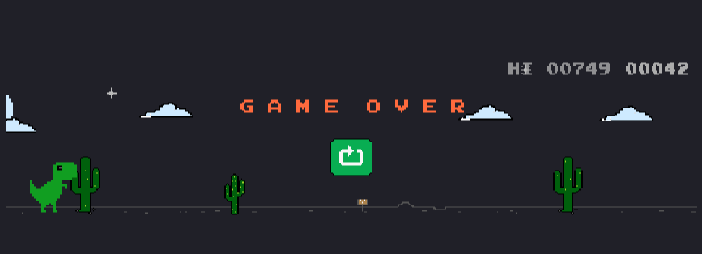

# Dino Colored Mod

Dino, but colored...

## How to use

- Copy the content of [script.js](https://raw.githubusercontent.com/vanflux/dino-colored/main/script.js) file
- Open [chrome://dino](chrome://dino)
- Open devtools (press F12)
- Paste the copied content on console and hit enter.
- Enjoy the colors

---

##  How I modify this script?

### Initially, setup all the necessary things:
- Clone repo
- Run `npm i`

### Modifying script:
- Run `npm run dev` to listen changes and generate `script.js`.
- Modify the `gen-script.js` file.
- After saving the file, `script.js` is ready to be used.
